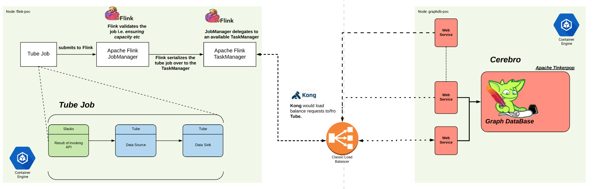
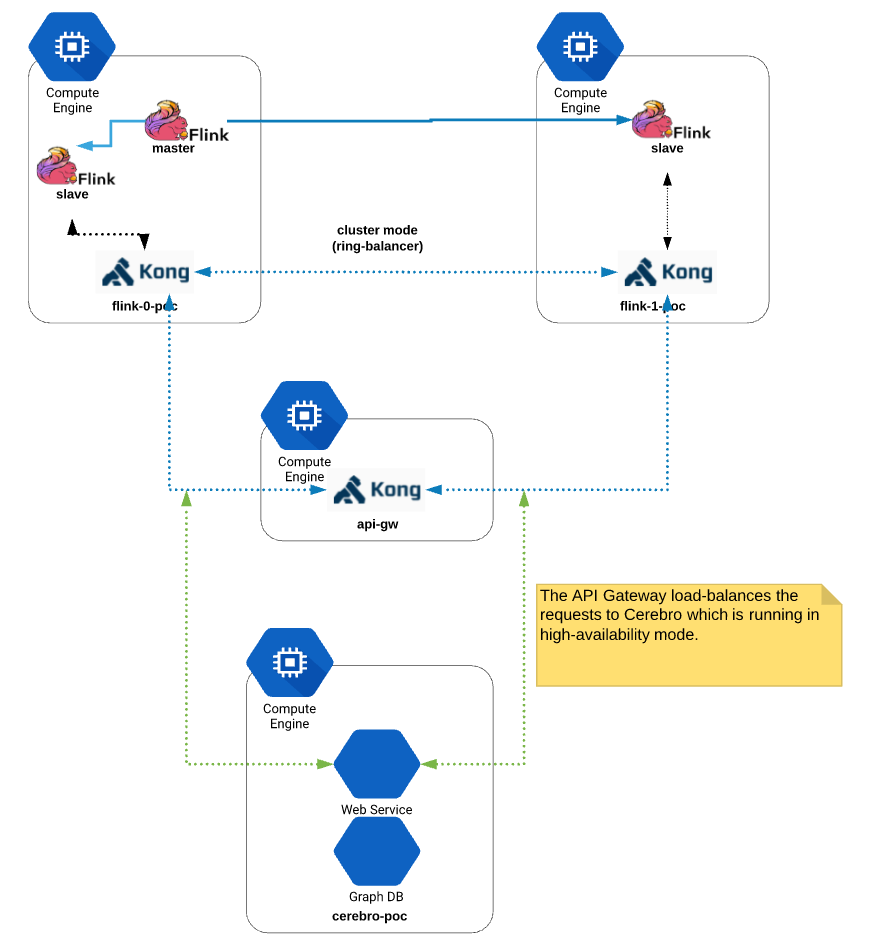

# Tube

The business problem to solve was to gather insights into user behaviors by
studying how users behave on Slack. The essential data problem here was to
create a pipelining technology that was able to ingest unbounded datasets and
apply _transformation_ to it.

When it comes to creating data pipelines that can handle unbounded datasets and
provide solutions to handle _out of order_ , late-arriving data; the goto tool
is Apache Beam or Apache Flink. I chose [Apache Flink](https://flink.apache.org) for this design
for the reasons that it was a green field project and it was a _test and learn_
approach. Apache Flink, at that time, had a good reputation of being an
industrial-strength solution that allows a processing topology to be defined in
their easy to follow SDKs.

# Tube Architecture

The architecture diagrams is:



In my setup, Apache Flink pipeling processing logic works with the [slacks](https://github.com/raymondtay/slacks) library i created
to extract, unmangle, sanitize the incoming data and _sinks_ that
post-processed data into _Cerebro_. The `Cerebro` is essentially a _**Graph Engine**_ that takes the data and deposits into its data structures for later retrieval rendering.


# QuickStart

This package is deployed against [Apache Flink](http://flink.apache.org) and is tested against version `1.4`.

*Note*: You need to have Apache Flink running in the environment prior. This
README assumes that you have a Apache Flink standalone cluster (i.e. 1 master
node with _n_ slave nodes.)

## Verify the installation

- Verify that Flink is running (Flink's Web UI is hosted on `http://<ip>:8081`)
- Run `sbt coverageOff assembly` (this should give you a _fat_ jar file e.g.  `tube-assembly-0.1-SNAPSHOT.jar`)
-- In CI/CD environments, this would be automated.
- Take that _fat_ jar file and run it against the Flink e.g. `bin/flink run tube-assembly-0.1-SNAPSHOT.jar`
- At this point in time, you should have the slack token which is ready to be
  consumed by `Tube`. The token is a long string which is prefixed by either
  `xoxp-`, `xoxa-` or `xoxb-` (*Note:* `Tube` does not support slack's legacy
  tokens; and you might need to quote the slack token to prevent the
  commandline to parse it.)

## Seed Users

`tube` uses `slacks` to extract the total number of users from slack via its
REST APIs. To run it, do the following:

- `cd $HOME/flink-1.4.0`
- `./bin/flink run tube-assembly-0.1-SNAPSHOT.jar -T <slack token> -X seed_users -S {none|fixed-delay|failure-rate}`

## Seed Channels

`tube` uses `slacks` to extract the total number of channels from slack via its
REST APIs. To run it, do the following:

- `cd $HOME/flink-1.4.0`
- `./bin/flink run tube-assembly-0.1-SNAPSHOT.jar -T <slack token> -X seed_channels -S {none|fixed-delay|failure-rate}`

## Seed Channel Posts

`tube` uses `slacks` to extract all posts from all detected channels (potentially, in parallel) from slack via its
REST APIs. To run it, do the following:

- `cd $HOME/flink-1.4.0`
- `./bin/flink run tube-assembly-0.1-SNAPSHOT.jar -T <slack token> -P {1|2|X number of parallel jobs} -X seed_posts -S {none|fixed-delay|failure-rate}`

## Get team info

`tube` uses `slacks` to extract team and emojis used by the team from slack via its REST APIs. To run it, do the following:

- `cd $HOME/flink-1.4.0`
- `./bin/flink run tube-assembly-0.1-SNAPSHOT.jar -T <slack token> -P {1|2|X number of parallel jobs} -X team_info -S {none|fixed-delay|failure-rate}`

Here is what you might get when you successfully ran it:


# Developers

Developers should not check in any IDE-related files. If the developer is
interested in testing, you can run a command like this : `sbt coverageOn clean test`

## Managing Dependencies

`tube` uses [sbt-updates](https://github.com/rtimush/sbt-updates) to stay connected with the latest version of
libraries needed for this project. The basic command to run to show a listing
of current libraries in project to latest versions on Maven would be:
```
sbt dependencyUpdates
```

Upgraded `tube`'s dependencies so that we can resolve the binary incompatibilities that arose from the 3rd party libraries that `tube` is leveraging upon. See `slacks`'s README.md for details.

Library name | Current version | Comments
-------------| ----------------|----------
`Cats`       | 1.0.1           | Upgrade from 0.9.0
`Eff`        | 5.0.0-RC1-20180101142835-0e4b73e| Bumped from `4.5.0` to support latest `Cats`
`Circe`      | 0.9.0 | Bumped from `0.8.0` to support latest `Cats`

## Code coverage

`tube` uses code coverage via [scoverage](https://github.com/scoverage/sbt-scoverage) because we believe we don't deliver shit to users.

*Note*: code coverage is enabled, by default. To disable it, change the
property of `coverageEnabled` to `false` in `build.sbt`. If you want to know
more customizations, please read the [official site](https://github.com/scoverage/sbt-scoverage)

### Usage

Run the command:
```
sbt clean coverage test
```

## Scala Style

`tube` uses the the sbt plugin [Scalastyle](http://www.scalastyle.org/sbt.html) for conformance of style.

### Usage

You will need a configuration file. The easiest way to get one is to use the `scalastyleGenerateConfig` command:
```
sbt scalastyleGenerateConfig
```
This will create a `scalastyle-config.xml` in the current directory, with the default settings. Then, you can check your code with the scalastyle command
```
sbt scalastyle
```
This produces a list of errors on the console, as well as an XML result file `target/scalastyle-result.xml` (CheckStyle compatible format).

Finally, to check whether the code in the repository conforms to the style, run
the command:
```
sbt test:scalastyle
```

## IntelliJ gitignore

The official `.gitignore` file in this project contains the following from
[here](https://github.com/github/gitignore/blob/master/Global/JetBrains.gitignore)

## Eclipse gitignore

The official `.gitignore` file in this project contains the following from 
[here](https://github.com/github/gitignore/blob/master/Global/Eclipse.gitignore)


Copyright(c) 2018 - 2020 Raymond Tay (raymondtay1974@gmail.com)
All rights reserved
