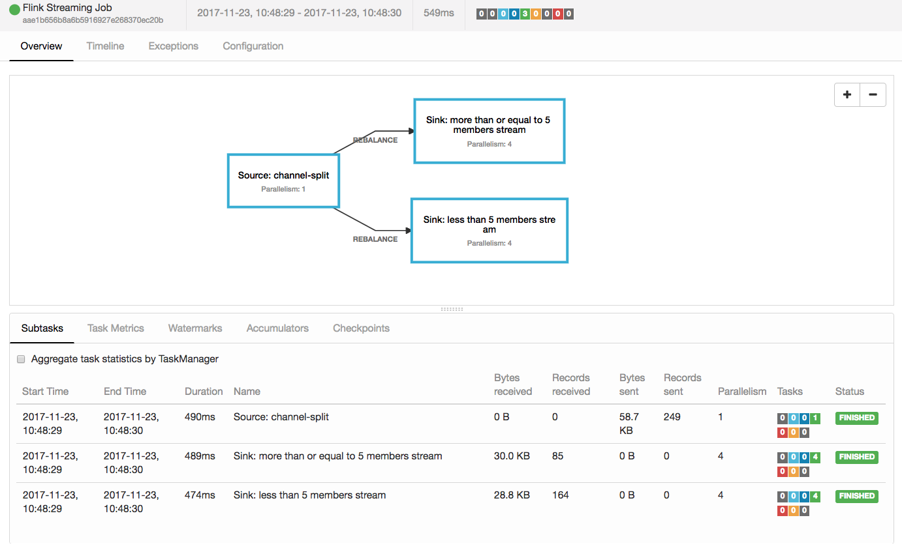

# tube

[](https://circleci.com/gh/nugit/tube/tree/master)

The pipeline for Slack 

# QuickStart

This package is deployed against [Apache Flink](http://flink.apache.org) and is
tested against version `1.3.2` though it is best to run against `1.4` as
there's source compatibility throughout.

Note: You need to have Apache Flink running in the environment prior 

- Verify that Flink is running (Flink's Web UI is hosted on `http://localhost:8081`)
- Run `sbt assembly` (this should give you a _fat_ jar file e.g.
  `tube-assembly-0.1-SNAPSHOT.jar`)
- Take that _fat_ jar file and run it against the Flink e.g. `bin/flink run
  tube-assembly-0.1-SNAPSHOT.jar`

Here is what you might get when you successfully ran it:


# Developers

Developers should not check in any IDE-related files.

## Managing Dependencies

`tube` uses [sbt-updates](https://github.com/rtimush/sbt-updates) to stay connected with the latest version of
libraries needed for this project. The basic command to run to show a listing
of current libraries in project to latest versions on Maven would be:
```
sbt dependencyUpdates
```

Upgraded `tube`'s dependencies so that we can resolve the binary incompatibilities that arose from the 3rd party libraries that `tube` is leveraging upon. See `slacks`'s README.md for details.

Library name | Current version | Comments
-------------| ----------------|----------
`Cats`       | 1.0.1           | Upgrade from 0.9.0
`Eff`        | 5.0.0-RC1-20180101142835-0e4b73e| Bumped from `4.5.0` to support latest `Cats`
`Circe`      | 0.9.0 | Bumped from `0.8.0` to support latest `Cats`

## Code coverage 

`tube` uses code coverage via [scoverage](https://github.com/scoverage/sbt-scoverage) because we believe we don't deliver shit to users.

*Note*: code coverage is enabled, by default. To disable it, change the
property of `coverageEnabled` to `false` in `build.sbt`. If you want to know
more customizations, please read the [official site](https://github.com/scoverage/sbt-scoverage)

### Usage

Run the command:
```
sbt clean coverage test
```

## Scala Style

`tube` uses the the sbt plugin [Scalastyle](http://www.scalastyle.org/sbt.html) for conformance of style. 

### Usage

You will need a configuration file. The easiest way to get one is to use the `scalastyleGenerateConfig` command:
```
sbt scalastyleGenerateConfig
```
This will create a `scalastyle-config.xml` in the current directory, with the default settings. Then, you can check your code with the scalastyle command
```
sbt scalastyle
```
This produces a list of errors on the console, as well as an XML result file `target/scalastyle-result.xml` (CheckStyle compatible format).

Finally, to check whether the code in the repository conforms to the style, run
the command:
```
sbt test:scalastyle
```

## IntelliJ gitignore

The official `.gitignore` file in this project contains the following from
[here](https://github.com/github/gitignore/blob/master/Global/JetBrains.gitignore)

## Eclipse gitignore

The official `.gitignore` file in this project contains the following from 
[here](https://github.com/github/gitignore/blob/master/Global/Eclipse.gitignore)

